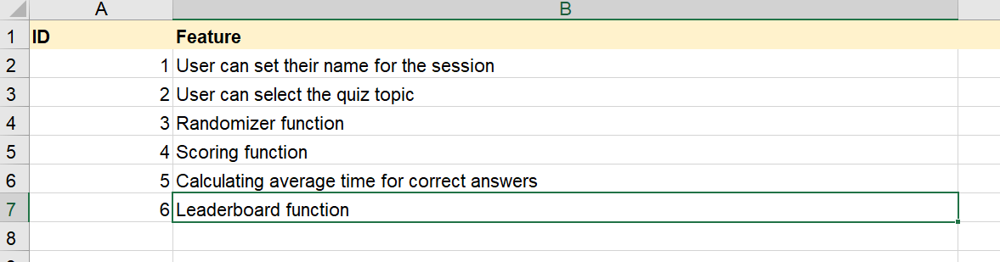

# Clahoot!

## Requirements
The only requirement to run Clahoot! on your local machine you will need to have Python 3.8 installed.

Note: This was created in a linux environment, so it may not run 100% correctly on another operating system.

## Instructions

### Running Clahoot! through Python:
1. Open the terminal on your system.
2. Find the file path to the location where you have saved the files for Clahoot!, namely main.py.
3. Enter the command "python path/to/location/main.py" into the terminal.

### Running Clahoot! as an executable script:
1. Open the terminal on your system.
2. Find the file path to the location where you have saved the files for Clahoot!, namely main.py.
3. Enter "which python" into the terminal, copy the path given by the command.
4. Open main.py in a text editor and replace the path on line 1 with the path you copied just before. Make sure you keep the #! on line 1!
5. Go back to the terminal and enter "chmod +x path/to/location/main.py".
6. Now you can run Clahoot! by simply using the command "./path/to/location/main.py".

Note: If main.py is in the current working directory you still need to indicate that in the terminal by using "./main.py".

### Additional Options
Clahoot! can be run with the following options (if viewing this in the terminal ignore the ` characters):
- `--help`: displays the contents of this readme file instead of running the actual app.
- `--anon`: runs Clahoot!, will ask you for a topic selection but does not ask you to enter a name, name will be set to "anonymous". This persists for the current session.
- `--random`: runs Clahoot!, will ask you for a name but not for your topic selection, a topic will be selected at random. This persists for the current session.
- `--start`: combination of `--anon` and `--random`, runs Clahoot! but will not ask for a name or topic selection and will skip the quiz instructions. After the welcome screen you will be taken straight to the start of a quiz.

# Software Development Plan

## Statement of Purpose and Scope
The purpose of this application is to allow users to play a fun, dynamic quiz game through the Terminal of their computer. It is named Clahoot! which is the combination of 'Cl' for command line, as this application runs in the Terminal and the Terminal is a command-line tool, and 'ahoot!' from the name of the Kahoot! game which inspired some of the features present in this application. Whether it's used to as a fun way to test or broaden your knowledge of the quiz topics available in the application or if you're only focused on getting the highest score on all the leaderboards, Clahoot! is sure to be a fun way to spend your free time or to take a little break from the monotony of your daily activities. The target audience for this application is primarily people who love quizzes or trivia and are looking for another option when it comes to terminal based quizzes. Though anyone with Python installed on their computer is able to join in on the fun and it's suitable for all ages.

Taking a look at the applications functionality, it works by taking a dictionary of questions, which need to be manually added into the program files, and uses the questions to create a quiz for the user to complete. The quiz needs to be dynamic and different each time to improve replayability and provide a better experience than would be achieved by having a quiz full of static questions and answers that you could very quickly memorise. It also needs to be able to accept input from users in the form of answers, topic selections and their name, both so the application can function correctly and to enable additional features. For each question it needs to give a score to correct and incorrect answers and track other quiz stats such as the total number of correctly answered questions. Rather than being a multiplayer quiz like Kahoot! which uses player scores to directly compete against one another while taking the same quiz, this single player focused quiz game instead utilises a leaderboard as a way of allowing players to compete and compare themselves to one another using their scores.

Using the application is very straightforward, upon starting the application the user is shown the welcome/title screen followed by the instructions. Afterwards they will be asked to enter a name and the topic they would like the quiz questions to be picked from. The application will then start the quiz and will display each question in sequence, allowing time for the user to both input their answer and to also review the question and answer before moving onto the next question when they are ready. At the end of the quiz a results screen will be displayed showing the users final scores and ask if they would like to view the leaderboard. At this point there will also be the option to either take another quiz or exit the application. All user input is expected to be alphanumeric characters, the specifics for each input prompt are explained throughout the application.

## Features

### Randomizer
The main feature of this application is for the quizzes to be heavily randomized so that no two quizzes are identical. While the same question might be used in different quizzes, it should not appear in the same place in the quiz and the choices should appear in different orders. There are two main functions that fall under the randomizer feature, the most prominent of the two is responsible for creating the question data to be used in the current quiz. It accomplishes this by using the `random` python module, it first uses `random.randint` to pick a random integer from 10-20 to determine the length of the quiz, then it uses `random.sample` to pick that number of questions from the dictionary containing the pool of questions creating a list. It then iterates over the question list to pull out all the required values from the dictionary and returns a list of lists to the main function to use as the quiz. The other function is responsible for getting the users topic selection, initially this wasn't considered a part of the randomizer feature but after implementing options that the application can be executed with, I decided to group it with the main randomizer function as certain executable options require the application to also randomly choose the topic of the quiz. When prompting for the user to make a topic selection, they are required to enter a number corresponding to the topic they would like to select, this required a try/except block to catch any errors that occur from any input that cannot be converted to the integer data type.

### Scoring System
Another feature of Clahoot! is it's scoring system and it was designed to be similar to Kahoot! though it doesn't use the same calculations. Rather than simply counting the number of correctly answered questions the system is responsible for calculating the score for each question based on the answer time and current answer streak, and keeps track of the total score, total correct answers, total answer time for correct answers, the current answer streak, the highest answer streak and the value of the answer streak for the previous question. In the current implementation, to avoid the use of global variables (though it may be an appropriate use in this situation) I created a list variable in the main function which is passed into the scoring function. After the scoring function has updated all the appropriate values within the list, using conditional control flow to determine what values need updating and how they need to be updated, the list is returned and set to the same variable. It keeps being passed back and forth after each question when it needs to be updated. While there is not direct interaction between the scoring system and the user, at the end of the quiz the average time taken for correctly answered questions is calculated. This function required error handling as it's possible, however unlikely, that there are no correct answers, which would mean that the function would try to perform a division by 0.

### Player Names and Leaderboard
Additionally to the scoring system, the application allows for the input of user names and uses this input along with the score from the scoring system to provide a leaderboard of high scores. The leaderboard function is responsible for loading/saving the leaderboard data, updating the data when new high scores are achieved and displaying the leaderboard at the end of a quiz if requested by the user. The function responsible for managing the leaderboard data requires variables from all the other features to maintain achieve it's purpose, the user name from the main function, the quiz topic and length from the randomizer to find to correct set of high scores for the current quiz and the final score from the scoring system. Error handling is present when the function tries to load previously saved leaderboard data from a pickle file, if the file isn't found the leaderboard function defaults to using preset, and made up, high scores. Once the leaderboard has been updated and saved, the list of high scores that was updated is returned from the function so that it can be used to display the leaderboard upon request by iterating over the list of high scores.

## User Interaction and Experience
The Clahoot! application is very simple and intuitive to use, there are no complicated inputs required and there are instructions on what is the valid inputs are for each input prompt. The application features require very little, if no, interaction from the user as they are responsible for background tasks such as picking the quiz questions or calculating a questions score. If a user is experiencing any difficulty in using the application there are two sources of information to help them use the application. The first is the help.md file which is also viewable in the terminal by running the application with the `--help` option. This file contains information and instructions related to correctly running the application on your computer. The second source of information is the application itself, it includes the instructions screen that is displayed after the welcome/title screen when running the application as well as all the instructions given to the user explaining what they need to do to move on and continue through the application. These instructions explain how the application works and how to use it correctly.

## Control Flow Diagram

## Implementation Plan
For this project I used Trello to assist in implementing the features I planned to include in my application, to prioritise the tasks I needed to complete and in general to assist in completing the project as a whole by the given deadline which is the 19th July 2020. Breaking down each feature into a list of tasks (which can be seen in the screenshots below) helped me focus on one thing at a time which was key in being able to implement each feature in an appropriate time frame. Using coloured labels on Trello helped with identifying which tasks belonged to which feature as well as understanding which tasks were a higher priority than others and needed to be completed first. Though for my application there were some less important tasks I decided to complete before higher priority tasks because it made sense to complete those tasks in the order that they are used in the application rather than the order of importance. I only tracked the development of the application in Trello, though it would be helpful in future projects to also track my progress with completing the necessary documentation as well.

Note: The following screenshots were taken on a 4k monitor, it may be difficult to view them properly without viewing them in full size.

## Testing
Test cases listed in the spreadsheet below were tested manually by myself. Test cases resulting in failures are still included in the spreadsheet to show that there were issues and bugs that were encountered during development and those have been fixed.

[Manual Testing Spreadsheet](./docs/andrew_gregorovic-T1A3-manual-testing.xlsx)

